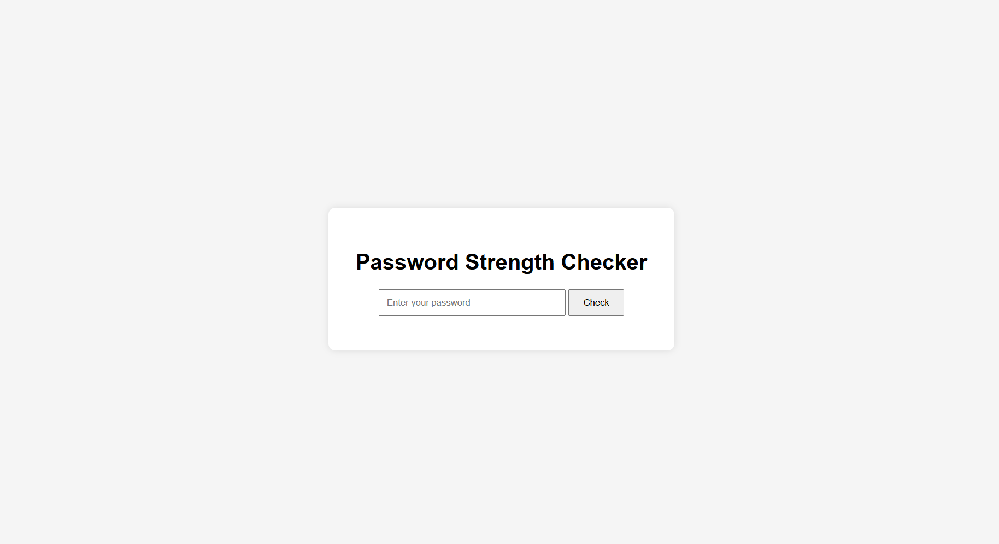

# 🔐 Password Strength Checker

[](https://www.python.org/)  
[](https://flask.palletsprojects.com/)  
[](LICENSE)  
[](https://github.com/atuli93/Password-Strength-Checker/stargazers)  
[](https://github.com/atuli93/Password-Strength-Checker/network/members)  
[](https://github.com/atuli93/Password-Strength-Checker/issues)

A **Flask web application** that evaluates the strength of passwords in real-time.  
It helps users learn about password security while practicing **Python web development**.

---

## 🚀 Features
- Real-time password strength analysis  
- Categorizes passwords as **Weak**, **Medium**, or **Strong**  
- Color-coded results for visual clarity  
- Clean and responsive web interface  
- Easy to run locally or deploy  

---

## 🛠 Installation

1. Clone the repository
   ```bash
   git clone https://github.com/atuli93/Password-Strength-Checker.git
   cd Password-Strength-Checker
   ```

2. Set up a virtual environment
   ```bash
   python3 -m venv .venv
   source .venv/bin/activate   # Linux/Mac
   .venv\Scripts\activate      # Windows
   ```

3. Install dependencies
   ```bash
   pip install -r requirements.txt
   ```


## ▶️ Usage

1. Run the Flask app:
   ```bash
   python app.py
   ```

Open your browser and visit:  
👉 [http://127.0.0.1:5000](http://127.0.0.1:5000)  

Type a password to see its strength immediately.


## 🧰 Tech Stack
- Python 3.11
- Flask 3.1
- HTML/CSS
- JavaScript (for dynamic feedback, if used)
> ⚠️ This tool is for educational purposes only. Do not enter real passwords.

---

## 📂 Project Structure
```
password-strength-checker/
├── app.py                 # Main Flask application
├── password_checker.py    # Password strength logic
├── requirements.txt       # Project dependencies
├── templates/
│   └── index.html         # Web UI templates
├── static/
│   └── style.css          # CSS styling
├── screenshots/           # Screenshots and demo GIF
└── README.md              # Project documentation
```


## 🖼 Screenshots

**Home Page**  


**Password Strength Result**  


---


## 📜 License

MIT License © 2025 [Atul Kumar](https://github.com/atuli93)  
See [LICENSE](LICENSE) for details.

---


## 🤝 Contributing

Pull requests are welcome! For major changes, please open an issue first to discuss.

---


## 💡 About

This project provides a hands-on way to learn about password security and Flask web development.  
It is designed for beginners and intermediate developers to explore web application development and security concepts.
