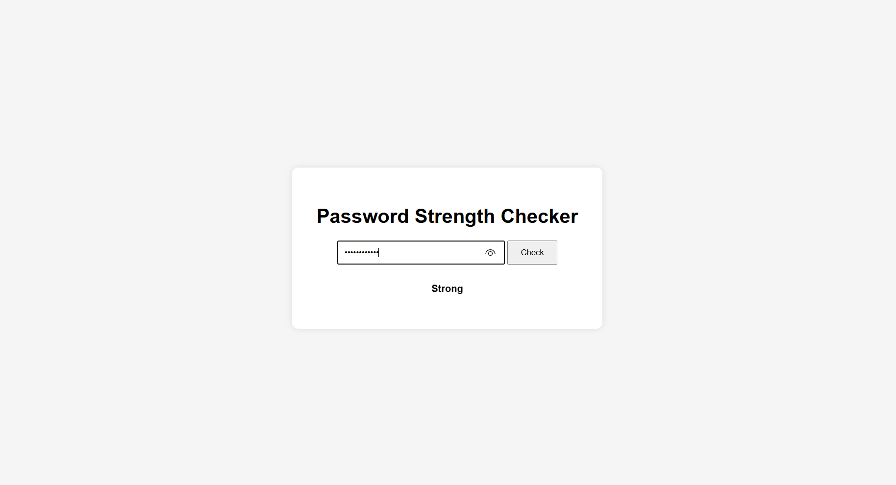

# 🔐 Password Strength Checker

[](https://www.python.org/)  
[](https://flask.palletsprojects.com/)  
[](LICENSE)  
[](https://github.com/atuli93/Password-Strength-Checker/stargazers)  
[](https://github.com/atuli93/Password-Strength-Checker/network/members)  

A **Flask web application** that evaluates the strength of passwords in real-time.  
It helps users learn about password security while practicing **Python web development**.

---

## 🚀 Features
- Real-time password strength analysis  
- Categorizes passwords as **Weak**, **Medium**, or **Strong**  
- Color-coded results for better clarity  
- Clean and responsive web interface  
- Easy to run locally or deploy  

---

## 🛠 Installation

### 1️⃣ Clone the repository
```bash
git clone https://github.com/atuli93/Password-Strength-Checker.git
cd Password-Strength-Checker

### 2️⃣ Set up virtual environment
```bash
python3 -m venv .venv
source .venv/bin/activate   # Linux/Mac
.venv\Scripts\activate      # Windows

### 3️⃣ Install dependencies
```bash
pip install -r requirements.txt

---

## ▶️ Usage

Run the Flask app:

```bash
python app.py

Open your browser and go to:  
👉 [http://127.0.0.1:5000](http://127.0.0.1:5000)  

Type a password to see its strength immediately.

---

## 📂 Project Structure
password-strength-checker/
│── app.py                 # Flask application
│── password_checker.py    # Logic to check password strength
│── requirements.txt       # Dependencies
│── templates/index.html   # Web UI
│── static/style.css       # CSS styling
│── screenshots/           # Optional screenshots
│── README.md              # Project documentation

---

## 🖼 Screenshots

**Home Page**  


**Password Strength Result**  


---

## 📜 License

MIT License © 2025 Atul Kumar

---

## 🤝 Contributing

Pull requests are welcome! For major changes, open an issue first to discuss.

---

## 💡 About

This project is a hands-on way to learn about password security and Flask web development.

